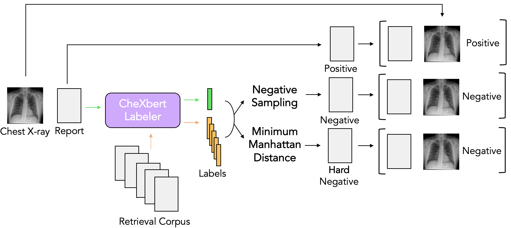
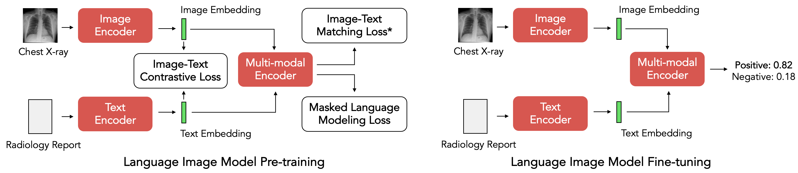
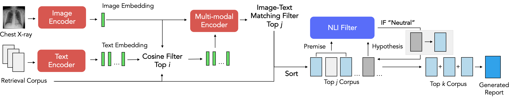

# X-REM

This is the offical repository for [X-REM (Contrastive X-Ray REport Match)](https://arxiv.org/abs/2303.17579), a retrieval-based radiology report generation module that uses learned image-text matching scores as the similarity metric for retrieval. We provide the implementation of X-REM as well as the source code for both training and inference for impression generation. 

Dataset generation for Image-Text Matching:
<p align="center">
  
</p>

X-REM Training:
<p align="center">
  
</p>

X-REM Inference:
<p align="center">
  
</p>

## Preparation

Clone X-REM github repo and its submodules:

```
git clone --recursive https://github.com/rajpurkarlab/X-REM.git
```

Move the X-REM python scripts to the appropriate folders:  
```
mv M2TransNLI.py m2trans_nli_filter.py ifcc
mv compute_avg_score.py prepare_df.py CXR-Report-Metric
```


Download our [pretrained checkpoints](https://drive.google.com/file/d/11UorBbh5cOcDfIzy_lCgMdn0zThvpDbp/view?usp=sharing) here!
   

## Data

Download the train/test reports and images from [MIMIC-CXR](https://physionet.org/content/mimic-cxr/2.0.0/). You may have to request for an approval to access the files.  `mimic_pretrain_study_id.csv` and `mimic_itm_study_id.csv` hold the MIMIC-CXR study ids we used to train our model, and `mimic_challenge_dicom_id.csv` holds the study id we set aside to use for radiologist evaluation. 

## Environment

Create a conda environment for X-REM:

```
conda env create -f environment.yml -n X-REM-env
```

Activate the environment:

```
conda activate X-REM-env
```

## Preprocessing
Refer to the data preprocessing step in [CXR-RePaiR](https://github.com/rajpurkarlab/CXR-RePaiR) to acquire `mimic_train_impressions.csv`, `mimic_test_impressions.csv`, and `cxr.h5`.  

Preprocess data to be used for pre-training ALBEF:

```
python3 -m preprocess_mimic.py --data_dir <path to MIMIC>  --impressions_train_path <path to mimic_train_impressions.csv> --impressions_test_path <path to mimic_test_impressions.csv> --out_dir <path to store the processed data>
```

## Training

To pretrain ALBEF, first specify the path to your training dataset in `configs/Pretrain.yaml` and run:
```
cd X-REM
python3 -m torch.distributed.launch --nproc_per_node=4 --use_env Pretrain.py --config configs/Pretrain.yaml --output_dir <output path>  --checkpoint <path to ALBEF_4M.pth>  --resume true
```
Generate train files for image-text matching task:

```
python generate_itm_train.py
```
Finetune the ALBEF model on image-text matching task:
```
cd X-REM
python3 -m torch.distributed.launch --nproc_per_node=4 --use_env ITM.py --config ./configs/ITM.yaml --output_dir <output path> --checkpoint <path to pre-trained checkpoint>
```

## Inference

Move to the `X-REM` directory: 

```
cd X-REM
```

Create the datasets to be used for inference. Use the `cxr.h5` and `mimic_train_impressions.csv` created during the preprocessing step. 
Note that the input dimension is 256 * 256 pixels for the pre-trained ALBEF and 384 * 384 for the fine-tuned ALBEF. 
```
import pandas as pd
from XREM_dataset import CXRTestDataset_h5

dset_cosine =  CXRTestDataset_h5(<path to cxr.h5>, 256)
dset_itm =  CXRTestDataset_h5(<path to cxr.h5>, 384)
train_data = pd.read_csv(<path to mimic_train_impressions.csv>)
reports = train_data["report"].drop_duplicates().dropna().reset_index(drop = True)
```

Initialize the config file by specifying the path to the trained checkpoints as well as their config files: 
```
from XREM_config import XREMConfig
config = XREMConfig(
        albef_retrieval_config = <path to the pre-trained ALBEF config>,
        albef_retrieval_ckpt = <path to the pre-trained ALBEF checkpoint>,
        albef_itm_config = <path to the fine-tuned ALBEF config>,
        albef_itm_ckpt = <path to the fine-tuned ALBEF checkpoint>,
)
```
Initialize the model with the trained weights and perform inference: 
```
from XREM import XREM
xrem = XREM(config)
itm_output = xrem(reports, dset_cosine, dset_itm)
```

Save the output as a pandas datframe: 

```
itm_df = pd.DataFrame(itm_output, columns = ['Report Impression'])
itm_df.to_csv(<preliminary save path>, index = False)
```

Post-process the result using a NLI filter: 
```
cd ../ifcc
conda activate m2trans
python3 m2trans_nli_filter.py --input_path <preliminary save path> --save_path <final save path>
conda deactivate
```

## Evaluation

```
cd CXR-Report-Metric
conda activate <environment name for CXR-Report-Metric>
python prepare_df.py --fpath <input path> --opath <output path>
python test_metric.py
python3 compute_avg_score.py --fpath <input path>
```
Refer to [CXR-Report-Metric](https://github.com/rajpurkarlab/CXR-Report-Metric) for a detailed explanation on the metric.

## Ablation Experiments

* To generate reports with varying top-k values, repeat the previous step with the following config file: 
```
config.albef_retrieval_top_k = <num reports retrieved with cosine sim>
config.albef_itm_top_k = <num reports retrieved with image-text matching scores>
```

* To generate reports without using the image-text matching scores, initialize the model with the following config file: 
```
config.albef_retrieval_top_k = 2
config.albef_retrieval_delimiter = ' '
config.albef_itm_top_k = 0
```

* To generate reports without the nli filter, initialize the model with the following config file:
```
config.albef_itm_delimiter = ' '
config.albef_itm_top_k = 1
```

* To replace the nli filter with bertscore as the metric for measuring redundancy, run the following command instead of `m2trans_nli_filter.py`:
```
cd X-REM
python3 bertscore_filter.py --input_path <preliminary save path> --save_path <final save path>
```
* To skip the pre-training step and directly fine-tune the off-the-shelf ALBEF checkpoint on image-text matching, re-train the model:
```
cd X-REM
python3 -m torch.distributed.launch --nproc_per_node=4 --use_env ITM.py --config ./configs/ITM.yaml --output_dir <output path> --checkpoint <path to ALBEF_4M.pth>
```
Then, initialize the config file with `albef_retrieval_ckpt = <path to ALBEF_4M.pth> ` and `albef_itm_ckpt = <output path>` . 

## Issues
Feel free to contact Jaehwan Jeong (jaehwanj@stanford.edu) regarding any questions regarding the code or our paper.

## Citation
```
Jeong, J., Tian, K. et al. Multimodal Image-Text Matching Improves Retrieval-based Chest X-Ray Report Generation. Medical Imaging with Deep Learning (2023)
```


